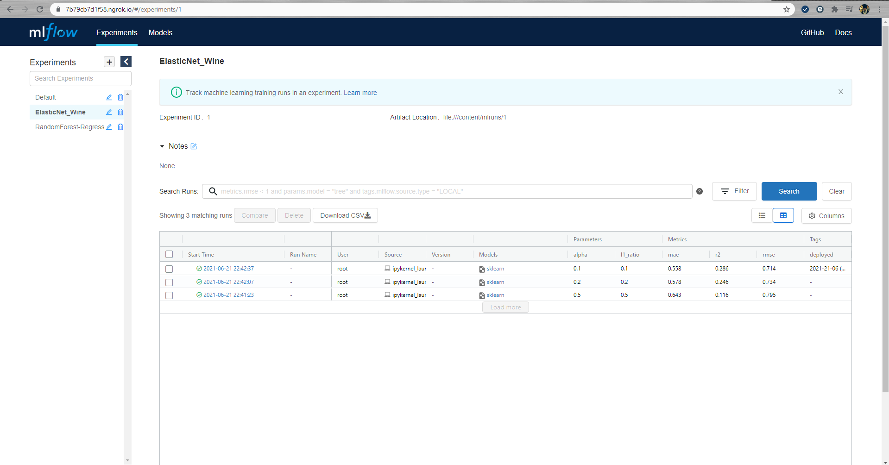
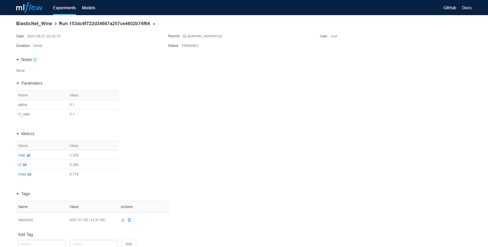
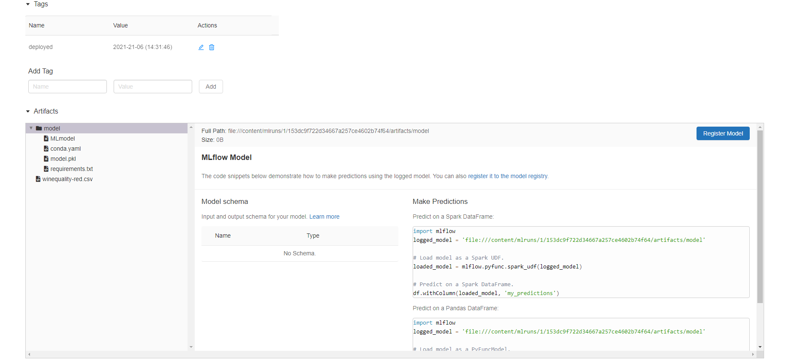
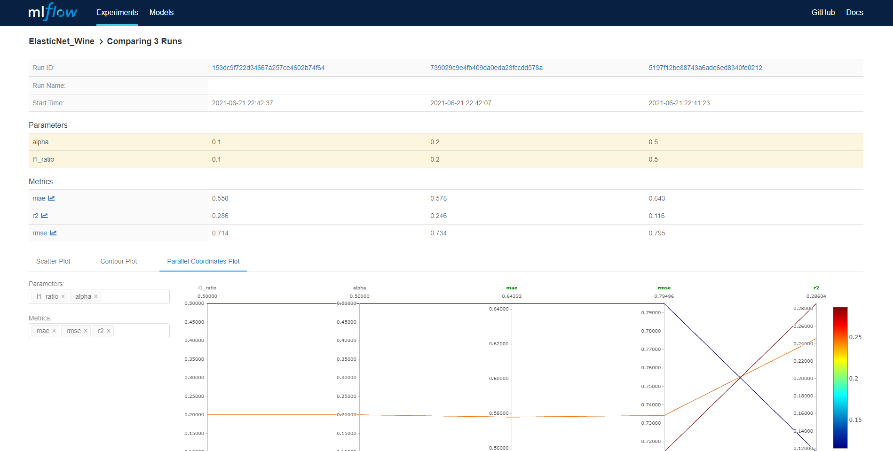
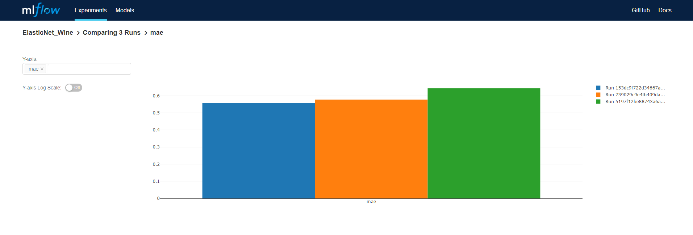

# ML-Flow-Tutorial
Basic ML Flow Usage

This is mlflow tutorial from databrics

Small modification from PyConDE & PyData Berlin 2019 Conference
[Youtube](https://www.youtube.com/watch?v=6z0_n8kxh-g)

Modify - Run on Colab with pyngrok

    

  
## MLFlow Dashboard

    
## Experiment Details

  

## Experiment Comparison

## Metrics Comparison

